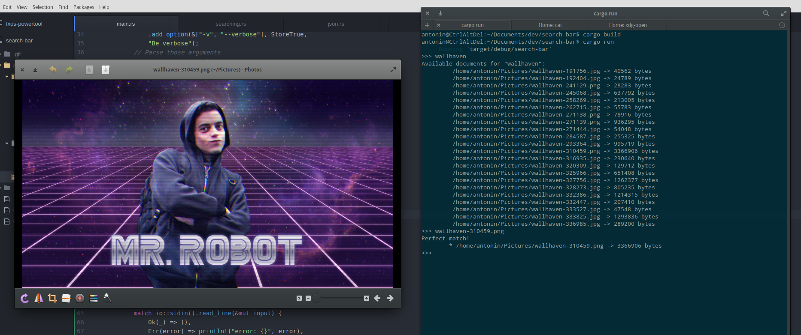
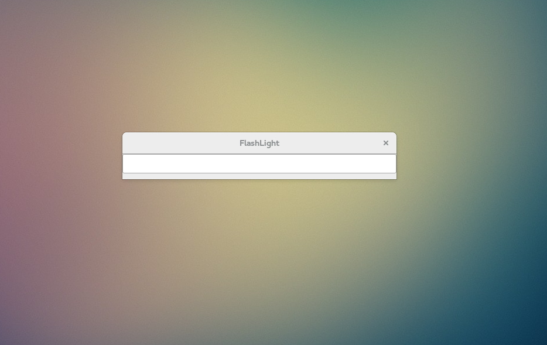
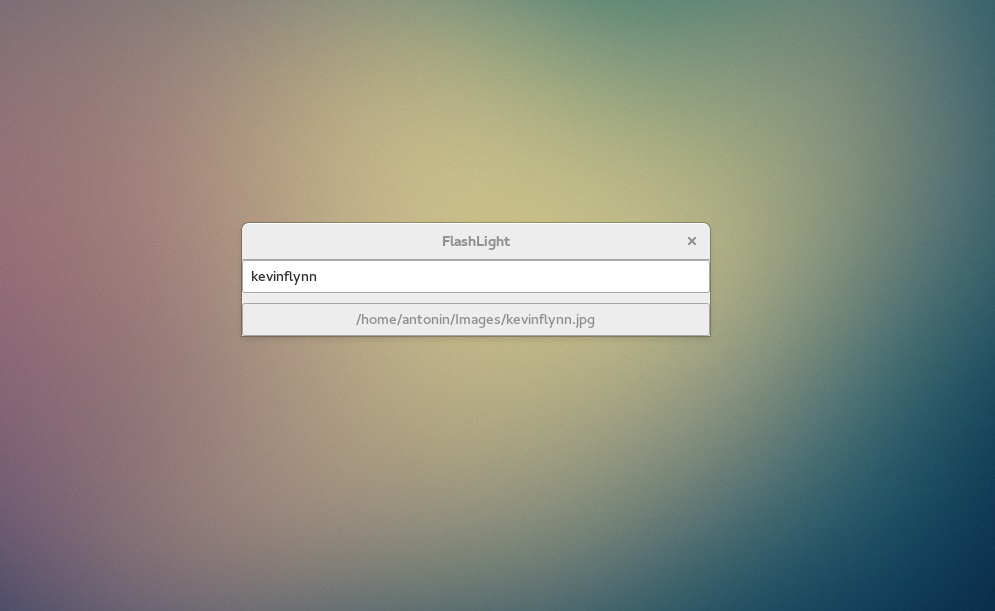
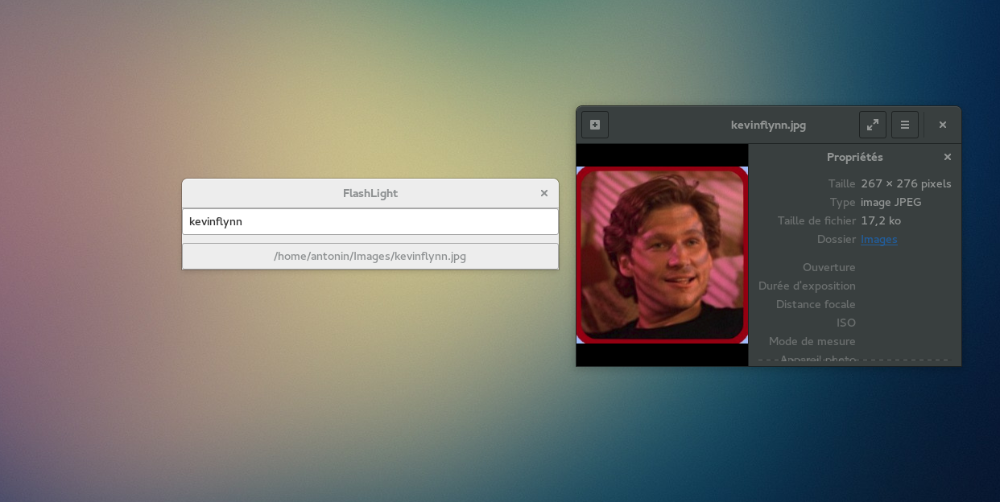

#  Flashlight

Flashlight is a personal project to support the usefull Spotlight software for GNU/Linux systems, in Rust.

The current version of Rust is the **1.7.0** (2016-02-29).

**Flashlight is still in development.**

To use it, please to install:
*	gcc,
*	gtk3-devel.

### How it works?

First of all, you have to compile the project with [cargo](https://crates.io/):
```
cargo build --release
```

After that, you have to give to Flashlight the repository to scan. The tool will scan all repositories from that path, and save informations about these files into a Json file, in your user repository (```.indexed_documents.json```).

To do that, please to use the option ```indexation```, like this:
```
cargo run -- --indexation /home/user/my/path
```

Finally, use Flashlight without gui or with a GTK gui (option ```visu```), like this:
```
cargo run -- --visu gui
```
or
```
cargo run -- --visu terminal
```

### Screenshots

#### Without gui



#### With gui

-> The search bar



-> A research



-> The result


